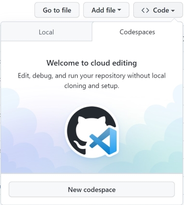

# Cluster API + Azure + Flux Demo

> Setup a Kubernetes fleet using Cluster API and Azure


## Overview

This is repo contains the necessary steps to get started using Cluster API in Azure

## Open with Codespaces

> You must be a member of the Microsoft OSS and CSE-Labs GitHub organizations

- Click the `Code` button on this repo
- Click the `Codespaces` tab
- Click `New Codespace`
- Choose the `4 core` option



## Stopping a Codespace

- Codespaces will shutdown automatically after being idle for 30 minutes
- To shutdown a codespace immediately
  - Click `Codespaces` in the lower left of the browser window
  - Choose `Stop Current Codespace` from the context menu

- You can also rebuild the container that is running your Codespace
  - Any changes in `/workspaces` will be retained
  - Other directories will be reset
  - Click `Codespaces` in the lower left of the browser window
  - Choose `Rebuild Container` from the context menu
  - Confirm your choice

- To delete a Codespace
  - <https://github.com/codespaces>
  - Use the context menu to delete the Codespace
  - Please delete your Codespace once you complete the lab
    - Creating a new Codespace only takes about 45 seconds!

## Login to Azure

Login to the azure subscription in which you will be deploying the management cluster.

```bash
export AZURE_SUBSCRIPTION_ID=<yourSubscriptionId>
az login --use-device-code
az account set --subscription $AZURE_SUBSCRIPTION_ID

```

## Create Management Cluster

We will need to create a management aks cluster in Azure that will manage the lifecycle of all our fleet clusters.

```bash
# Set the name of your new resource group.
export AZURE_RG_NAME=capi-demo
export AZURE_LOCATION=southcentralus


# Make sure the resource group name is already taken
az group list -o table | grep $AZURE_LOCATION

# Create new resource group
az group create -n $AZURE_LOCATION -l $AZURE_RG_LOCATION

# Create AKS Cluster (this will take a 5-10 mins)
az aks create -g $AZURE_LOCATION -n capi-management --node-count 1 --generate-ssh-keys

# Connect to the management cluster
az aks get-credentials --resource-group $AZURE_LOCATION --name capi-management

# Verify AKS node is ready
k get nodes

# You should be able to see the nodepool to be in Ready state

# NAME                                STATUS   ROLES   AGE     VERSION
# aks-nodepool1-34273201-vmss000000   Ready    agent   4m15s   v1.22.11
```

## Initialize the management cluster with Cluster API

```bash

# Enable support for managed topologies and ClusterClass
export CLUSTER_TOPOLOGY=true

# TODO: Create Service principal via CLI

# Create an Azure Service Principal in Azure portal, make sure this SP has access to the resource group
export AZURE_TENANT_ID="<Tenant>"
export AZURE_CLIENT_ID="<AppId>"
export AZURE_CLIENT_SECRET="<Password>"

# Base64 encode the variables
export AZURE_SUBSCRIPTION_ID_B64="$(echo -n "$AZURE_SUBSCRIPTION_ID" | base64 | tr -d '\n')"
export AZURE_TENANT_ID_B64="$(echo -n "$AZURE_TENANT_ID" | base64 | tr -d '\n')"
export AZURE_CLIENT_ID_B64="$(echo -n "$AZURE_CLIENT_ID" | base64 | tr -d '\n')"
export AZURE_CLIENT_SECRET_B64="$(echo -n "$AZURE_CLIENT_SECRET" | base64 | tr -d '\n')"

# Settings needed for AzureClusterIdentity used by the AzureCluster
export AZURE_CLUSTER_IDENTITY_SECRET_NAME="cluster-identity-secret"
export CLUSTER_IDENTITY_NAME="cluster-identity"
export AZURE_CLUSTER_IDENTITY_SECRET_NAMESPACE="default"

# Create a secret to include the password of the Service Principal identity created in Azure
# This secret will be referenced by the AzureClusterIdentity used by the AzureCluster
kubectl create secret generic "${AZURE_CLUSTER_IDENTITY_SECRET_NAME}" --from-literal=clientSecret="${AZURE_CLIENT_SECRET}"

# Initialize the management cluster for azure
clusterctl init --infrastructure azure

```

## Setup Flux for Management Cluster

Bootstrapping the management cluster with flux will help us manage the workload cluster definitions.

```bash

# Install Flux
flux install

# Verify Flux install
flux check


# Flux bootstrap (set $GITHUB_PAT for the cluster to use)
flux bootstrap git \
  --url "https://github.com/joaquinrz/capi-demo" \
  --branch main \
  --token-auth \
  --password ${GITHUB_PAT} \
  --path "/deploy/management/bootstrap"

# Pull latest changes
git pull
```

## Deploy Clusters using CAPI and Flux

Now that the management cluster has been initialized with CAPI and Flux, let us generate a few cluster crds using our helper script.

```bash

# Set machine specifications
export AZURE_CONTROL_PLANE_MACHINE_TYPE="Standard_D2s_v3"
export AZURE_NODE_MACHINE_TYPE="Standard_D2s_v3"

# This script will invoke clusterctl over the cluster names passed as arguments and generate their respective yamls
scripts/cluster_create.sh cluster-$AZURE_LOCATION-01 cluster-$AZURE_LOCATION-02 cluster-$AZURE_LOCATION-03

# Deploy the cluster via flux
git add deploy/management/clusters/

git commit -m 'added worker clusters yaml to management cluster'

git push

# Force Flux Reconicile
flux reconcile source git flux-system && flux reconcile kustomization flux-system


# Generate kubeconfig for cluster
clusterctl get kubeconfig cluster-southcentralus-01 > cluster-southcentralus-01.kubeconfig

# Deploy CNI
kubectl --kubeconfig=./cluster-southcentral-01.kubeconfig apply -f https://raw.githubusercontent.com/kubernetes-sigs/cluster-api-provider-azure/main/templates/addons/calico.yaml

# Check cluster nodes
kubectl --kubeconfig=./cluster-southcentral-01.kubeconfig get nodes


```

### Engineering Docs

- Team Working [Agreement](.github/WorkingAgreement.md)
- Team [Engineering Practices](.github/EngineeringPractices.md)
- CSE Engineering Fundamentals [Playbook](https://github.com/Microsoft/code-with-engineering-playbook)

## How to file issues and get help

This project uses GitHub Issues to track bugs and feature requests. Please search the existing issues before filing new issues to avoid duplicates. For new issues, file your bug or feature request as a new issue.

For help and questions about using this project, please open a GitHub issue.

## Contributing

This project welcomes contributions and suggestions.  Most contributions require you to agree to a Contributor License Agreement (CLA) declaring that you have the right to, and actually do, grant us the rights to use your contribution. For details, visit <https://cla.opensource.microsoft.com>

When you submit a pull request, a CLA bot will automatically determine whether you need to provide a CLA and decorate the PR appropriately (e.g., status check, comment). Simply follow the instructions provided by the bot. You will only need to do this once across all repos using our CLA.

This project has adopted the [Microsoft Open Source Code of Conduct](https://opensource.microsoft.com/codeofconduct/). For more information see the [Code of Conduct FAQ](https://opensource.microsoft.com/codeofconduct/faq/) or contact [opencode@microsoft.com](mailto:opencode@microsoft.com) with any additional questions or comments.

## Trademarks

This project may contain trademarks or logos for projects, products, or services.

Authorized use of Microsoft trademarks or logos is subject to and must follow [Microsoft's Trademark & Brand Guidelines](https://www.microsoft.com/en-us/legal/intellectualproperty/trademarks/usage/general).

Use of Microsoft trademarks or logos in modified versions of this project must not cause confusion or imply Microsoft sponsorship.

Any use of third-party trademarks or logos are subject to those third-party's policies.
